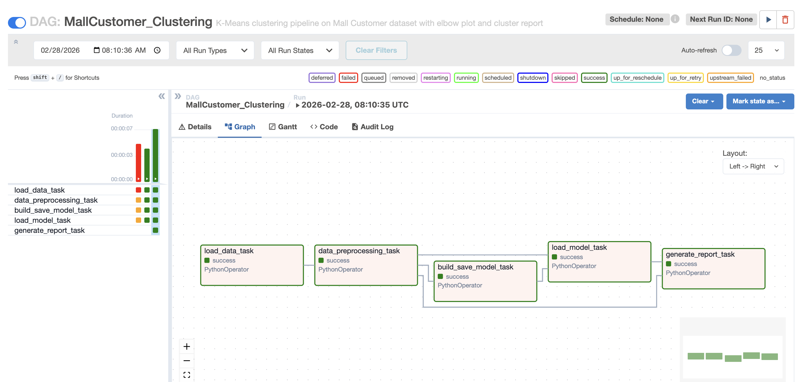
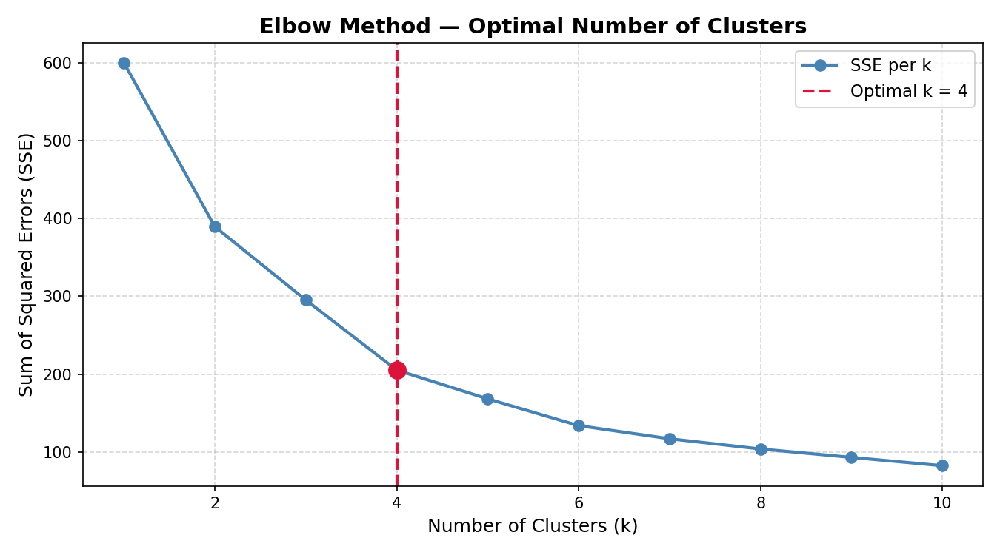

# Airflow Lab 1 - Mall Customer Segmentation
Author: Bhanu Harsha Y
---
An Apache Airflow pipeline that automates K-Means clustering on the Mall Customers dataset to determine the optimal number of customer segments using the **Elbow Method**. The pipeline runs entirely inside Docker — no local Python installation required.

---

## Project Structure
```
airflow_lab1/
├── config/
├── dags/
│   ├── data/
│   │   ├── file.csv               # Full Mall Customers dataset (200 records)
│   │   └── test.csv               # Subset for quick testing (20 records)
│   ├── model/
│   │   └── model.sav              # Saved K-Means model (generated at runtime)
│   ├── outputs/
│   │   ├── elbow_curve.png        # Elbow curve plot (generated at runtime)
│   │   └── cluster_report.txt    # Cluster summary report (generated at runtime)
│   ├── src/
│   │   ├── __init__.py
│   │   └── lab.py                 # Core ML functions
│   └── airflow.py                 # DAG definition
├── logs/
├── plugins/
├── .env
├── docker-compose.yaml
└── README.md
```

---

## DAG Overview: `MallCustomer_Clustering`

The DAG consists of 5 sequential tasks:
```
load_data_task >> data_preprocessing_task >> build_save_model_task >> load_model_task >> generate_report_task
```

| Task | Function | Description |
|------|----------|-------------|
| `load_data_task` | `load_data()` | Reads `file.csv`, selects Age, Annual Income & Spending Score features |
| `data_preprocessing_task` | `data_preprocessing()` | Drops nulls, applies StandardScaler normalization |
| `build_save_model_task` | `build_save_model()` | Fits K-Means for k=1–10, computes SSE, saves model to `model/model.sav` |
| `load_model_task` | `load_model_elbow()` | Loads saved model, applies KneeLocator to find optimal clusters, saves elbow curve plot |
| `generate_report_task` | `generate_report()` | Fits final model with optimal k, generates per-cluster statistics report |

---

## DAG Graph



---

## Elbow Curve

The elbow curve is automatically generated and saved to `dags/outputs/elbow_curve.png` after each run.



---

## Cluster Report

Sample output from `generate_report_task` logs:
```
=======================================================
   MALL CUSTOMER SEGMENTATION — CLUSTER REPORT
=======================================================
  Optimal k (Elbow Method) : 4
  Total customers          : 200
=======================================================

  Cluster 0  (X customers)
    Avg Age            : XX.X
    Avg Annual Income  : $XX.Xk
    Avg Spending Score : XX.X
    Age Range          : XX - XX
...
=======================================================
```

---

## Prerequisites

- **Docker Desktop** installed and running (allocate at least 4GB RAM)
- **Git**

---

## Setup & Running the Lab

### Step 1: Navigate to the lab directory
```bash
cd airflow_lab1
```

### Step 2: Fetch the official Airflow Docker Compose file
```bash
# macOS / Linux
curl -LfO 'https://airflow.apache.org/docs/apache-airflow/2.9.2/docker-compose.yaml'

# Windows (cmd)
curl -o docker-compose.yaml https://airflow.apache.org/docs/apache-airflow/2.9.2/docker-compose.yaml
```

### Step 3: Create required directories
```bash
# macOS / Linux
mkdir -p ./logs ./plugins ./config ./dags/outputs

# Windows (cmd)
mkdir logs plugins config dags\outputs
```

### Step 4: Set Airflow UID (macOS/Linux only)
```bash
echo -e "AIRFLOW_UID=$(id -u)" > .env
```

> On Windows, the `.env` file is already provided with `AIRFLOW_UID=50000`.

### Step 5: Update `docker-compose.yaml`

Find and update the following fields:
```yaml
# Disable example DAGs
AIRFLOW__CORE__LOAD_EXAMPLES: 'false'

# Install required Python packages
_PIP_ADDITIONAL_REQUIREMENTS: ${_PIP_ADDITIONAL_REQUIREMENTS:- pandas scikit-learn kneed matplotlib}

# Mount working data directory
- ${AIRFLOW_PROJ_DIR:-.}/working_data:/opt/airflow/working_data

# Set admin credentials
_AIRFLOW_WWW_USER_USERNAME: ${_AIRFLOW_WWW_USER_USERNAME:-airflow2}
_AIRFLOW_WWW_USER_PASSWORD: ${_AIRFLOW_WWW_USER_PASSWORD:-airflow2}

# Update webserver port if 8080 is in use
ports:
  - "8081:8080"
```

### Step 6: Initialize the Airflow database
```bash
docker compose up airflow-init
```

### Step 7: Start Airflow
```bash
docker compose up
```

Wait until you see:
```
airflow-webserver-1  | 127.0.0.1 - - [date] "GET /health HTTP/1.1" 200 ...
```

### Step 8: Access the Airflow UI

- Open: [http://localhost:8081](http://localhost:8081)
- Username: `airflow2`
- Password: `airflow2`

### Step 9: Trigger the DAG

1. Find `MallCustomer_Clustering` in the DAGs list
2. Click the **▶ Trigger DAG** button
3. Monitor progress in the **Graph** view — all 5 tasks should turn green

### Step 10: View Results

- Click `load_model_task` → **Logs** → see optimal clusters output
- Click `generate_report_task` → **Logs** → see full cluster report
- Check `dags/outputs/elbow_curve.png` for the elbow plot
- Check `dags/outputs/cluster_report.txt` for the saved report

### Step 11: Stop Airflow
```bash
docker compose down
```

---

## Dataset

**Mall Customers Dataset** — 200 records with features:

| Feature | Description |
|---------|-------------|
| `Age` | Customer age |
| `Annual Income (k$)` | Annual income in thousands of dollars |
| `Spending Score (1-100)` | Store-assigned spending behavior score |

Source: [Kaggle - Customer Segmentation](https://www.kaggle.com/datasets/vjchoudhary7/customer-segmentation-tutorial-in-python)

---

## Dependencies

All packages are installed automatically inside the Docker container:

| Package | Purpose |
|---------|---------|
| `pandas` | Data loading and manipulation |
| `scikit-learn` | StandardScaler and KMeans |
| `kneed` | KneeLocator for elbow method detection |
| `matplotlib` | Elbow curve visualization |

---

## GitHub Setup

Add the following to `.gitignore`:
```
__pycache__/
*.pyc
logs/
plugins/
config/
dags/model/model.sav
.env
docker-compose.yaml
```
