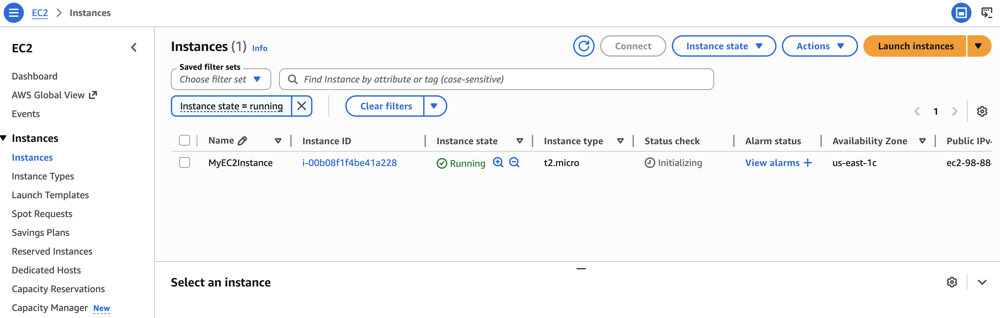
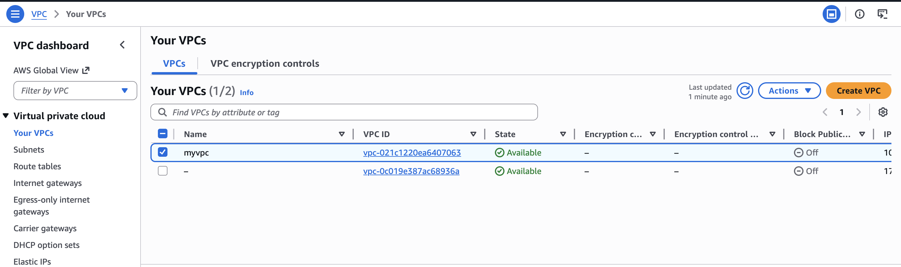
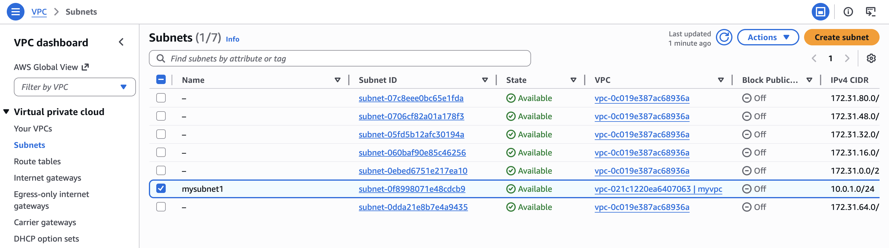

# Terraform Beginner Lab - AWS Infrastructure with EC2, VPC & Subnet
## Author: Bhanu Harsha Y
## Overview

In this lab, I used Terraform to provision AWS infrastructure by writing a `main.tf` configuration file. I started by creating a single EC2 instance, then added a Name tag to it, and then expanded the configuration to include a VPC and subnet. After verifying all resources in the AWS Console, I used `terraform destroy` to tear everything down. This gave me hands-on experience with the core Terraform commands (`init`, `plan`, `apply`, `destroy`) and helped me understand how Infrastructure as Code (IaC) works in practice.

## Resources Created

| Resource | Name | Details |
|----------|------|---------|
| EC2 Instance | MyEC2Instance | `t2.micro`, Ubuntu AMI (`ami-0e2c8caa4b6378d8c`), us-east-1 |
| VPC | myvpc | CIDR block `10.0.0.0/16` |
| Subnet | mysubnet1 | CIDR block `10.0.1.0/24`, inside myvpc |

## Project Structure

```
Terraform_Lab/
├── main.tf                  # Terraform configuration (provider + resources)
├── .gitignore               # Excludes .terraform/, state files, secrets
├── .terraform.lock.hcl      # Dependency lock file (auto-generated)
└── README.md                # This file
```

## Prerequisites

- **AWS Account** with an active access key
- **Terraform** installed ([Install Guide](https://developer.hashicorp.com/terraform/tutorials/aws-get-started/install-cli))
- **AWS CLI credentials** configured via environment variables

Install Terraform on macOS:

```bash
brew tap hashicorp/tap
brew install hashicorp/tap/terraform
terraform --version
```

## Steps to Re-run the Lab

### 1. Set AWS Credentials

Export your AWS access key and secret key in your terminal session:

```bash
export AWS_ACCESS_KEY_ID=<your-access-key-id>
export AWS_SECRET_ACCESS_KEY="<your-secret-access-key>"
```

> **Note:** These are session-only. You'll need to re-export them if you open a new terminal or restart your machine.

### 2. Initialize Terraform

Navigate to the lab directory and initialize the project. This downloads the AWS provider plugin.

```bash
cd Terraform_Lab
terraform init
```

### 3. Preview the Execution Plan

Review what Terraform will create before making any changes:

```bash
terraform plan
```

### 4. Apply the Configuration

Create the resources on AWS. Type `yes` when prompted to confirm.

```bash
terraform apply
```

This creates the EC2 instance, VPC, and subnet in the `us-east-1` region. You can verify each resource in the AWS Console.

### 5. Verify in AWS Console

- **EC2 → Instances** - Confirm `MyEC2Instance` is running as `t2.micro`
- **VPC → Your VPCs** - Confirm `myvpc` exists with CIDR `10.0.0.0/16`
- **VPC → Subnets** - Confirm `mysubnet1` exists with CIDR `10.0.1.0/24` inside `myvpc`

### 6. Destroy All Resources

Tear down everything Terraform created. Type `yes` to confirm.

```bash
terraform destroy
```

Verify in the AWS Console that the EC2 instance is terminated and the VPC/subnet are removed.

## Lab Walkthrough

### Part 1 - Setting Up Terraform

Ran `terraform init` to download the AWS provider plugin (v6.39.0). This created the `.terraform/` directory and `.terraform.lock.hcl` lock file.

### Part 2 - Creating an EC2 Instance

Defined a `t2.micro` EC2 instance using an Ubuntu AMI. Ran `terraform plan` to preview, then `terraform apply` to launch it. Confirmed the instance was running in the AWS Console with instance ID `i-00b08f1f4be41a228`.

### Part 3 - Modifying Resources

Added a `Name = "MyEC2Instance"` tag to the EC2 resource and re-applied. Terraform detected the in-place change and updated the tag without recreating the instance.

### Part 4 - Adding VPC and Subnet

Appended a VPC (`10.0.0.0/16`) and a subnet (`10.0.1.0/24`) to `main.tf`. On `terraform apply`, Terraform created both new resources while leaving the existing EC2 instance untouched - demonstrating incremental infrastructure changes.

### Part 5 - Destroying Resources

Ran `terraform destroy` to remove all 3 resources (EC2, subnet, VPC). Terraform handled the dependency order automatically - destroying the subnet before the VPC, since the subnet depends on the VPC.

### Part 6 - Understanding Terraform Files

- **`terraform.tfstate`** - JSON file tracking the current state of managed resources. Critical for Terraform to detect drift and plan changes. Should never be edited manually.
- **`.terraform/`** - Directory containing downloaded provider plugins. Created by `terraform init`.
- **`.terraform.lock.hcl`** - Locks provider versions for reproducibility across machines.

## Key Terraform Commands

| Command | Purpose |
|---------|---------|
| `terraform init` | Initialize project, download providers |
| `terraform plan` | Preview changes without applying |
| `terraform apply` | Create/update infrastructure |
| `terraform destroy` | Remove all managed resources |
| `terraform fmt` | Auto-format `.tf` files |
| `terraform validate` | Check configuration syntax |

## Screenshots

### EC2 Instance Running


### VPC Created


### Subnet Created



## Cost Considerations

- **EC2 t2.micro** is covered under the AWS Free Tier (750 hrs/month for the first 12 months). Outside the free tier, it costs ~$0.0116/hour.
- **VPC and Subnet** are free - AWS does not charge for creating these resources.
- **Always run `terraform destroy`** after completing the lab to avoid unexpected charges.

## References

- [Terraform AWS Provider Docs](https://registry.terraform.io/providers/hashicorp/aws/latest/docs)
- [Terraform CLI Commands](https://developer.hashicorp.com/terraform/cli/commands)
- [Professor Ramin Mohammadi's Lab Guide](https://github.com/raminmohammadi/MLOps/tree/main/Labs/Terraform_Labs/AWS/Lab1_Beginner)